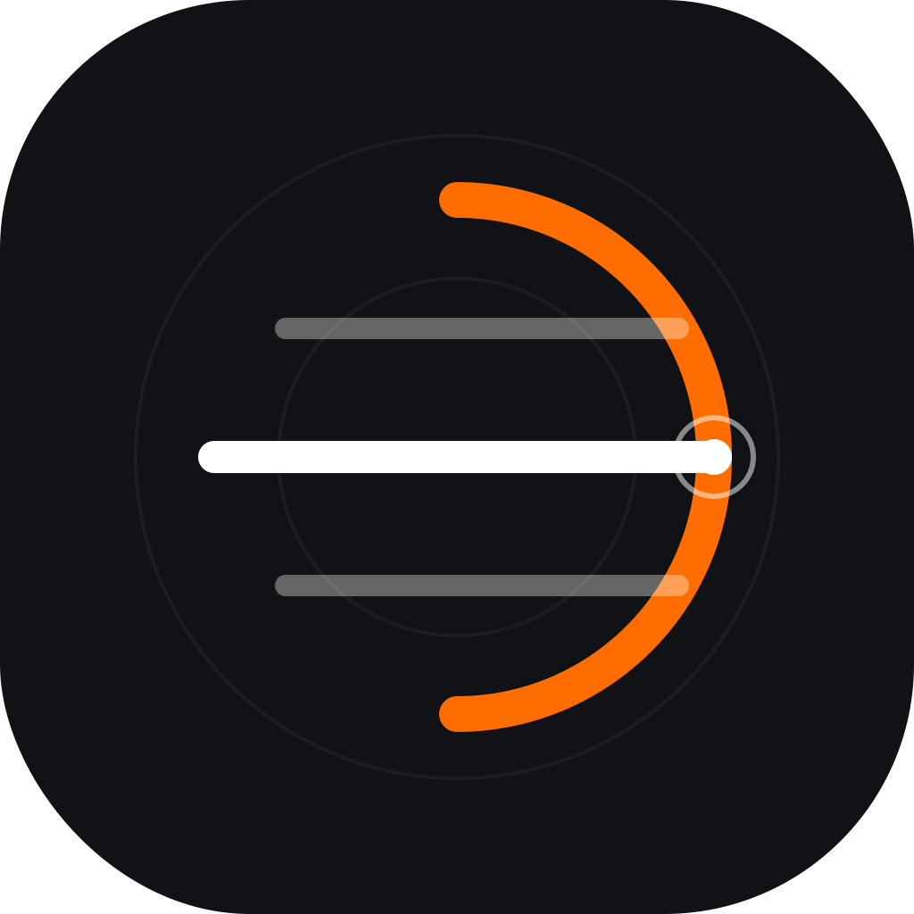

<p align="center">
  
</p>

<h1 align="center">DartCam</h1>

<p align="center">
  <strong>Minimal dart scorer — snap a photo or tap to score.</strong><br/>
  Built for friend hangouts. Works on Android and iOS.
</p>

<p align="center">
  
  
  
</p>

---

## Download

> **Current:** v0.2.1+2 Beta. Download available builds from [GitHub Releases](https://github.com/sayanmohsin/dartcam/releases) and install the APK on your Android device.

The release script produces `DartCam-v0.2.1.apk` for the arm64 Android build.

---

## What is DartCam?

DartCam is a clean, no-fuss dart scoring app. No account or password is required; optional cloud sync uses an email identifier to scope data.

**Two ways to score:**
- **Camera** — snap a photo of the board after your throw, DartCam detects where your darts landed using on-device ML
- **Manual** — tap a visual dartboard to enter scores

**Optional cloud sync:** push aggregate match results to a shared thingd.cloud instance, scoped by your email.

## Features

| | |
|---|---|
| Camera detection | TFLite on-device ML (DeepDarts D2 YOLOv4-tiny) detects darts and calibration points |
| Dartboard picker | Visual board overlay — tap where the dart landed, confirm with one click |
| Manual entry | Quick tap-to-score with multiplier validation (no triple bull, no double 25) |
| Match modes | 301, 501, 701, 1001 with double-out enforcement |
| Bust detection | Over-bust, can't-finish-on-1, must-finish-on-double — all handled |
| Undo | Made a mistake? Undo the last dart |
| Match persistence | Event-sourced via thingd embedded engine — resume where you left off |
| Player profiles | Lifetime stats tracked across matches (wins, 180s, checkouts, centuries) |
| Multiplayer | 2–8 players with automatic turn rotation |
| Cloud sync (optional) | Aggregate results pushed to thingd.cloud, scoped by email |
| Dark theme | Neon orange accent on dark background — easy on the eyes for late-night games |
| Branded splash | Clean loading screen with fade-in animation |
| About page | Built by [Sayan Mohsin](https://github.com/sayanmohsin) |

## How It Works

DartCam uses an **on-device TFLite model** (DeepDarts D2):

1. **Calibrate** — take a photo of your empty board. The model detects 4 calibration points on the board (at 20, 6, 3, 11 o'clock positions)
2. **Throw** — take a photo after each turn. The model detects up to 3 dart tips
3. **Transform** — a perspective homography (DLT) maps the detected points to a canonical dartboard
4. **Score** — polar coordinates determine the wedge, ring (single/double/triple), and bull for each dart

All processing happens **on your device**. No internet required for scoring.

## Tech Stack

| Layer | Technology |
|-------|-----------|
| Framework | Flutter (Dart) |
| Camera | camera (CameraX on Android, AVFoundation on iOS) |
| ML detection | TFLite via tflite_flutter (DeepDarts D2 YOLOv4-tiny) |
| State management | ValueNotifier + MatchStateManager (event-sourced) |
| Local persistence | thingd v0.83.2 RocksDB (embedded Rust via flutter_rust_bridge) |
| Cloud sync (optional) | thingd.cloud REST API (email-scoped) |
| Tests | 81 Dart + 27 Rust (108 total) |
| SVG icons | flutter_svg |
| Icons | flutter_launcher_icons |
| Native splash | flutter_native_splash |

## Project Structure

```
lib/
├── main.dart                              # App entry, theme, routing
├── core/
│   ├── constants/dartboard_constants.dart  # Board dimensions, wedge values
│   └── vision/
│       ├── ml_engine.dart                  # TFLite inference + YOLOv4 decode + NMS
│       └── dartboard_scorer.dart           # DLT homography + polar coordinate scoring
├── data/
│   ├── models/
│   │   ├── match_state.dart                # DartMatchState, MatchStatus
│   │   ├── player_profile.dart             # PlayerProfile with lifetime stats
│   │   ├── turn_mutation.dart              # Single turn event
│   │   └── detection_log.dart              # ML detection diagnostics
│   └── state/match_state_manager.dart      # Event-sourced game loop
├── services/
│   ├── thingd_service.dart                 # Dart wrapper for all 6 thingd traits
│   ├── thingd_service_interface.dart       # Abstract interface (testability)
│   ├── cloud_auth_service.dart             # thingd.cloud connection management
│   └── cloud_usage_service.dart            # Match result + player stats sync
├── presentation/
│   ├── screens/
│   │   ├── 00_splash_screen.dart           # Branded loading + email check
│   │   ├── 01_turn_screen.dart             # Scoreboard + enter score
│   │   ├── 03_detection_screen.dart        # ML detection + review flow
│   │   ├── 04_about_screen.dart            # About page
│   │   ├── 05_cloud_settings_screen.dart   # Cloud config + email + sync status
│   │   └── 06_email_screen.dart            # One-time email entry
│   └── widgets/
│       ├── dartboard_picker.dart           # Interactive visual dartboard
│       ├── manual_picker_grid.dart         # Score grid alternative
│       └── score_badge.dart                # Score display badge
rust/
├── src/api/bridge.rs                       # FRB bridge: all 6 thingd traits
├── tests/bridge_tests.rs                   # 27 Rust integration tests
└── Cargo.toml                              # thingd v0.83.2 + RocksDB feature
```

## Getting Started

### Prerequisites
- [Flutter SDK](https://docs.flutter.dev/get-started/install) (3.44+)
- Rust toolchain (for FRB codegen)
- Android device or emulator

### Run the app

```bash
git clone https://github.com/sayanmohsin/dartcam.git
cd dartcam
flutter pub get
flutter run
```

### Cloud configuration (optional)

thingd.cloud sync stores aggregate match results in a shared cloud instance, scoped by your email. To enable it:

```bash
# One-time setup
bash scripts/setup-cloud.sh

# Or manually:
#   npx @thingd/cli cloud login
#   npx @thingd/cli cloud token create dartcam
#   cp .env.example .env   # paste the token
```

### Build release APK

```bash
bash scripts/setup-cloud.sh          # if not already configured
flutter build apk --release

# Only include cloud configuration when explicitly approved for the artifact:
DARTCAM_INCLUDE_CLOUD_CONFIG=true ./scripts/release.sh
```

### Publish beta release

```bash
./scripts/release.sh
```

Builds an AAB and arm64 APK, then creates a versioned GitHub release. Cloud configuration is excluded by default.

## Testing

```bash
# Rust tests (27)
cd rust && cargo test

# Dart unit tests (81)
flutter test
```

## Status

**Beta v0.2.1** — camera detection works best with:
- Well-lit dartboards
- Clear dart visibility (no blurry shots)
- Consistent board position between calibration and throw photos

Manual entry with the visual dartboard picker works as a fallback.

## License

Apache 2.0

## Built by

**[Sayan Mohsin](https://github.com/sayanmohsin)**
